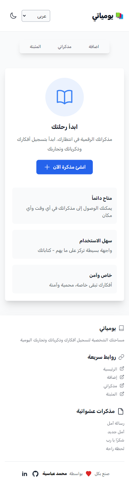

# Journal App 📝

> **Visit the live site: [Journal React App](https://journal-mo3bassias-projects.vercel.app/)**

A bilingual (English/Arabic) journaling application built with React that allows users to capture their daily thoughts, memories, and experiences.

## 📸 Screenshots

### Light/Dark Mode - الوضع النهاري/الليلي
<div align="center">
  
  
</div>

### Features Preview - معاينة المميزات

| Feature | English | العربية |
|---------|---------|----------|
| 📠Add New Note / إضاÙØ© مذكرة |  |  |
| 📌 Pinned Notes / المثبتة |  |  |
| 🔠Search & Categories / البحث والتصنيÙات |  |  |
| 🏷️ Categories / التصنيفات |  |  |

### Mobile View - عرض الموبايل
<div align="center">
  
  
</div>

## ✨ Features

- **Bilingual Support**: with customizable categories
- **Pin Important Notes**: Keep crucial notes easily accessible
- **Date Navigation**: Browse Full support for both English and Arabic languages
- **Dark/Light Mode**: Customizable theme preference
- **Rich Text Notes**: Create, edit, and organize your thoughts
- **Mood Tracking**: Express your feelings with emoji-based mood indicators
- **Categories**: Organize notes notes by date with an interactive calendar
- **PWA Support**: Install as a Progressive Web App for offline access
- **Local Storage**: All data is stored locally for privacy

## 🚀 Tech Stack

- **React** - UI Framework
- **Vite** - Build Tool (First time using Vite!)
- **React Router** - Navigation (First React Router DOM project after learning it)
- **TailwindCSS** - Styling
- **React Day Picker** - Date Selection
- **Vite PWA** - Progressive Web App functionality (First time implementing PWA)
- **LocalStorage** - Data Persistence

## 📦 Icons

The project uses multiple icon libraries for a rich user interface:

- Lucide React
- Heroicons
- Flowbite Icons

## 🛠️ Installation

1. Clone the repository:

```bash
git clone https://github.com/Mo3bassia/journal-react-app.git
```

2. Install dependencies:

```bash
cd journal-react-app
npm install
```

3. Start the development server:

```bash
npm run dev
```

4. Build for production:

```bash
npm run build
```

## 🎯 Usage

1. **Adding Notes**:

   - Click the "Add" tab
   - Fill in the note details (title, category, content)
   - Select a mood (optional)
   - Save your note

2. **Managing Notes**:

   - View all notes in the `Notes` tab
   - Filter by date or category
   - Pin important notes
   - Edit or delete existing notes

3. **Customization**:
   - Toggle between light/dark mode
   - Switch between English and Arabic
   - Create custom categories

## 📱 PWA Features

- Installable on desktop and mobile devices
- Offline functionality
- Fast loading times
- Automatic updates

## 🔒 Privacy

All data is stored locally in your browser using LocalStorage. No data is sent to any external servers.

## 🎨 Color Themes

The app includes a carefully selected color palette for both light and dark modes, ensuring optimal readability and visual comfort.

## 🌐 Browser Support

- Chrome (latest)
- Firefox (latest)
- Safari (latest)
- Edge (latest)

## 🎓 Learning Experience

This project represents several firsts in my development journey:

- First time using Vite as a build tool
- First complete project using React Router DOM after learning it
- First time implementing PWA functionality using Vite PWA
- First time working with multiple icon libraries in a single project

## 📄 License

This project is licensed under the MIT License - see the LICENSE file for details.

## 🤝 Contributing

Contributions are welcome! Please feel free to submit a Pull Request.
